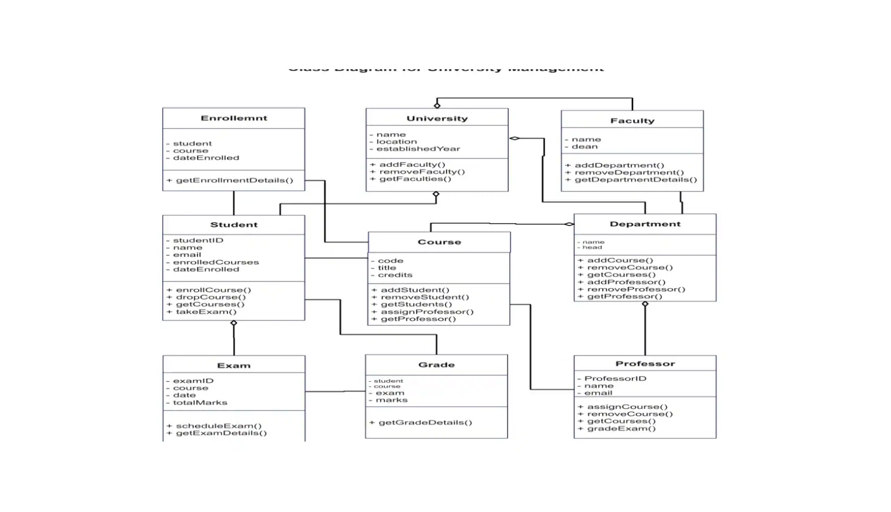
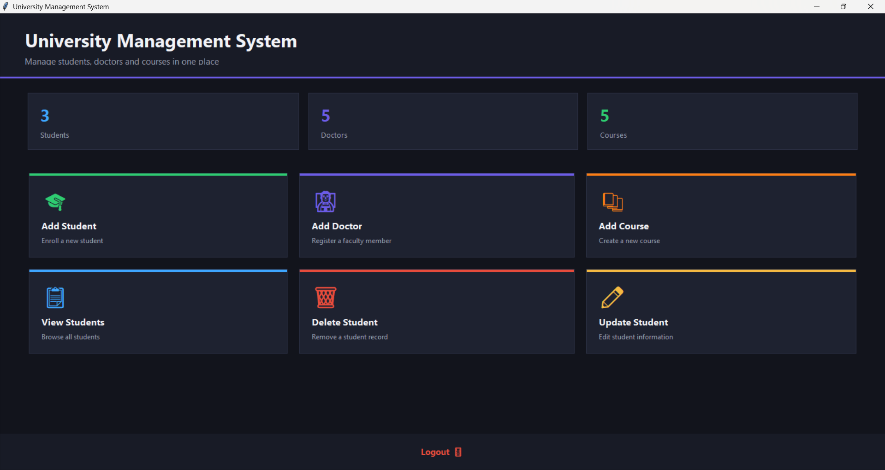
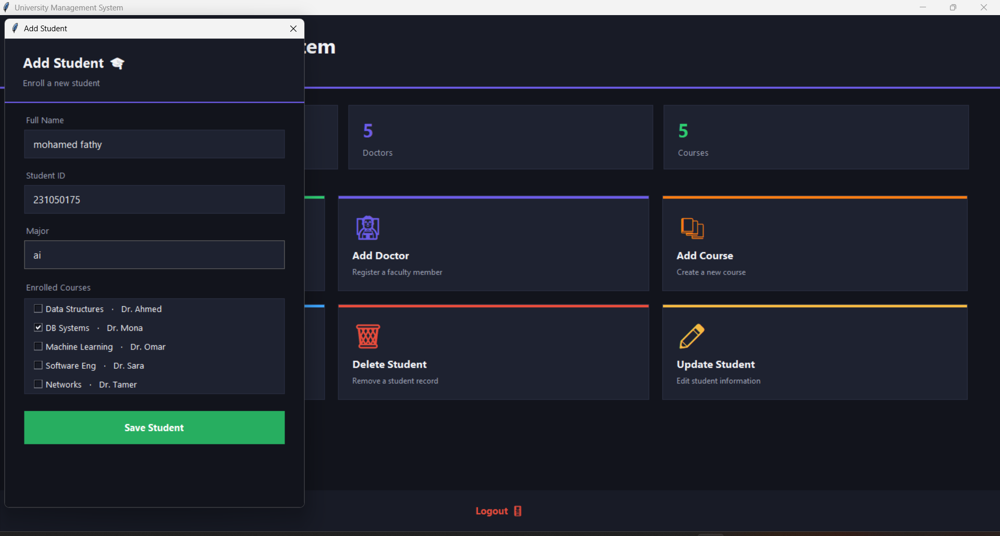
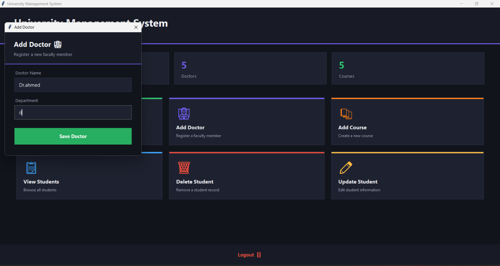
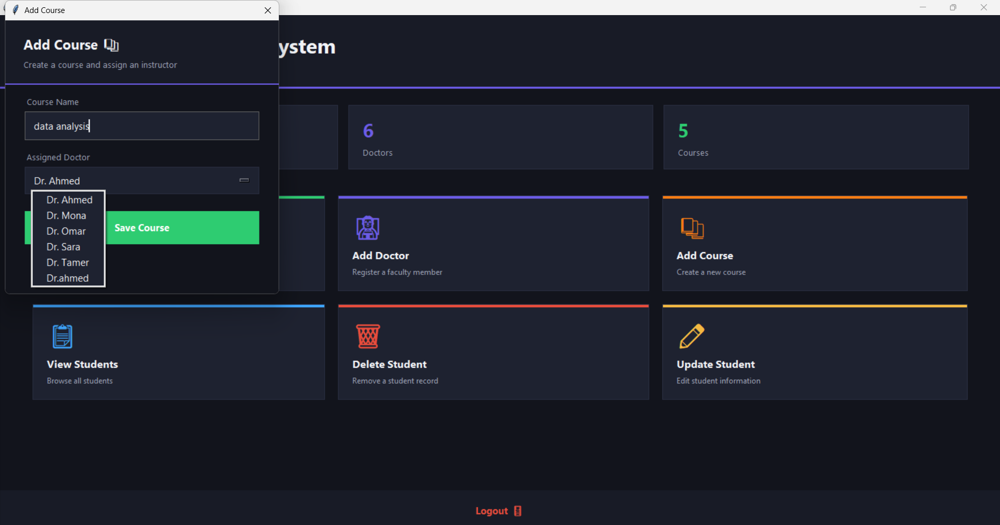
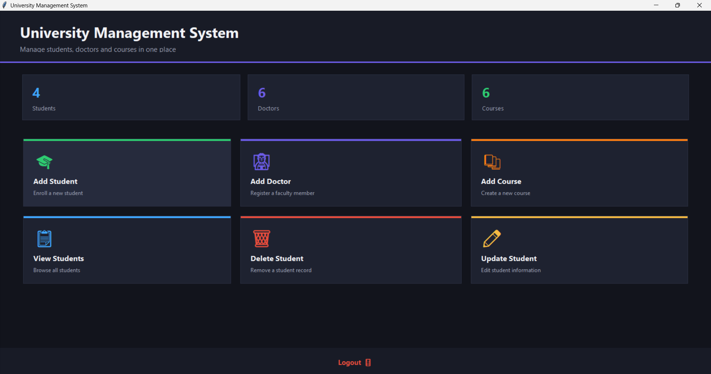

# 🎓 University Management System

A desktop-based **University Management System** built with **Python, OOP, and Tkinter**.

The project demonstrates core Object-Oriented Programming concepts through a simple and professional graphical user interface for managing students, doctors, and courses.

## 🚀 Features

* Add and manage students
* Add and manage doctors
* Add and manage courses
* Assign doctors to courses
* Enroll students in courses
* Display student, doctor, and course information
* Interactive Tkinter GUI
* Dark professional dashboard
* Object-Oriented design using classes and inheritance

## 🧠 OOP Concepts

This project demonstrates:

* **Abstraction** using `ABC` and `abstractmethod`
* **Inheritance** through the `Person`, `Student`, and `Doctor` classes
* **Encapsulation** through class attributes and methods
* **Polymorphism** through the `display_info()` method
* **Composition / Relationships** between students, doctors, and courses

## 🛠️ Technologies

* Python
* Tkinter
* Object-Oriented Programming
* Git & GitHub

## 📁 Project Structure

```text
university-management-system/
│
├── models/
│   ├── __init__.py
│   ├── person.py
│   ├── student.py
│   ├── doctor.py
│   └── course.py
│
├── screenshots/
│   ├── main-dashboard.png
│   ├── add-student.png
│   ├── add-doctor.png
│   ├── add-course.png
│   └── all-records-added.png
│
├── .gitignore
├── README.md
├── class-diagram-for-university-management.webp
└── university_system.py
```

## 📊 Class Diagram



## 🖥️ Screenshots

### Main Dashboard



### Add Student



### Add Doctor



### Add Course



### All Records



## ▶️ How to Run

1. Clone the repository.
2. Open the project folder.
3. Make sure Python is installed.
4. Run:

```bash
python university_system.py
```

## 🎯 Project Goal

The goal of this project is to apply **Object-Oriented Programming principles** in a practical application while building a functional graphical interface for a university management system.

